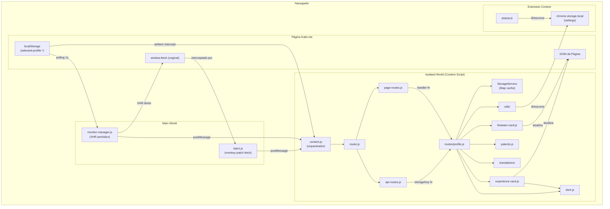
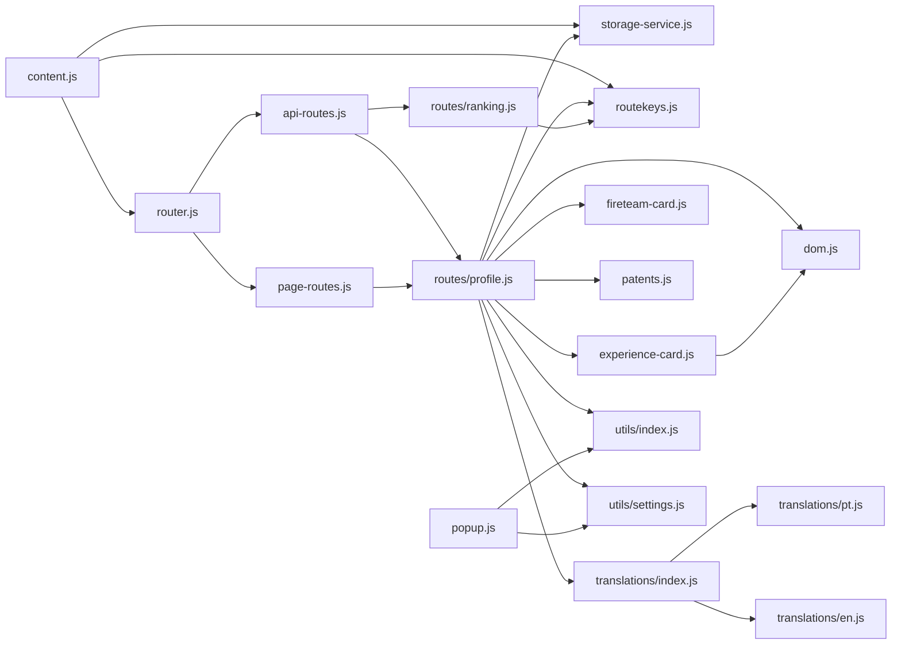

# Arquitetura

## Tipo de Aplicação

**Browser Extension — Manifest V3**

Extensões Manifest V3 operam com múltiplos contextos de execução isolados:

| Contexto | Arquivo | Capacidades |
|---|---|---|
| **Main World** (página) | `inject.js`, `monitor-manager.js` | Acesso total ao `window`, `fetch`, `localStorage`, variáveis da página |
| **Isolated World** (content script) | `content.js` | DOM compartilhado com a página, mas JS isolado |
| **Extension Context** (popup) | `popup.js` | APIs `chrome.*`, sem acesso ao DOM da página |

---

## Padrões de Projeto

### Feature-Based + Module Pattern
O projeto organiza o código por responsabilidade funcional:
- `data/` — dados e roteamento declarativo
- `lib/` — módulos de infraestrutura reutilizáveis
- `content-scripts/routes/` — handlers de feature por página

### Observer Pattern (Fetch Interceptor)
`inject.js` implementa um interceptor de `window.fetch` (monkey-patch) que notifica o content script via `postMessage` sempre que uma resposta de API relevante chega.

### Router Pattern
`router.js` + `page-routes.js` + `api-routes.js` implementam um roteador simples baseado em regex, desacoplando o despachante (`content.js`) dos handlers específicos de cada página/API.

### Monitor Pattern
`monitor-manager.js` implementa monitores periódicos que executam chamadas XHR independentes, publicam resultados via `postMessage` e re-executam ao detectar troca de perfil.

### Service Layer
`StorageService` é um serviço singleton com prefixação de chaves e cache em memória. `initializeStoredValues` é um serviço de bootstrap para `chrome.storage.local`.

### Static Utility Classes
`DOM`, `ExperienceCard` e `FireteamCard` usam o padrão de classe estática/método utilitário para manter a lógica de UI isolada.

---

## Separação de Responsabilidades

```
┌─────────────────────────────────────────────────────────────┐
│                   MAIN WORLD (página)                       │
│                                                             │
│  inject.js — monkey-patch fetch, postMessage dados          │
│                                                             │
│  monitor-manager.js — monitores periódicos via XHR          │
│    ├── ExperienceRankingMonitor (polling 10min + on-switch) │
│    └── FireteamRankingMonitor   (polling 10min + on-switch) │
└────────────────────┬────────────────────────────────────────┘
                     │ postMessage("FCABR_EXTENSION")
┌────────────────────▼────────────────────────────────────────┐
│           ISOLATED WORLD (content script)                   │
│                                                             │
│  content.js ──► router.js ──► api-routes.js                 │
│       │                  └──► page-routes.js                │
│       │                                                     │
│       │  (intercept localStorage.setItem → renderPage)      │
│       │                                                     │
│       ▼                                                     │
│  StorageService (Map em memória)                            │
│       │                                                     │
│       ▼                                                     │
│  routes/profile.js ──► dom.js                               │
│                    ├──► experience-card.js                  │
│                    ├──► fireteam-card.js                    │
│                    ├──► patents.js                          │
│                    └──► translations/                       │
└────────────────────┬────────────────────────────────────────┘
                     │ chrome.storage.local
┌────────────────────▼────────────────────────────────────────┐
│           EXTENSION CONTEXT (popup)                         │
│  popup.js ──► initializeStoredValues                        │
│           └──► chrome.tabs API                              │
└─────────────────────────────────────────────────────────────┘
```

---

## Diagrama de Arquitetura (Mermaid)



---

## Diagrama de Dependências entre Módulos



---

## Limitações Arquiteturais

| Aspecto | Situação |
|---|---|
| Clean Architecture / DDD | Não aplicado — projeto pequeno, não necessário |
| Injeção de Dependência | Não existe — dependências importadas diretamente |
| Service Worker (background) | Não implementado — extensão opera 100% por content scripts e page scripts |
| Estado global reativo | Não existe — dados transitam por `Map` em memória sem reatividade |
| Suporte a XHR no inject.js | Não implementado — apenas `fetch` é interceptado |
