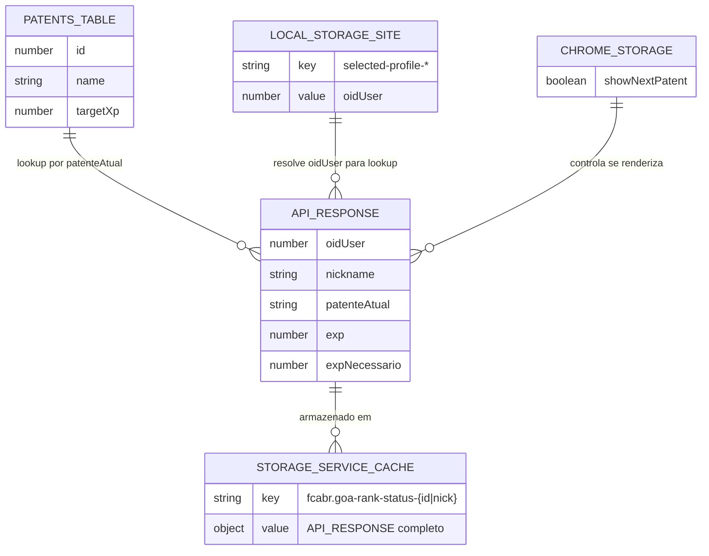

# Banco de Dados e Armazenamento

Este projeto não usa banco de dados relacional. O armazenamento é dividido em três camadas.

---

## Camada 1: Cache em Memória (`StorageService`)

**Arquivo:** `src/lib/storage-service.js`
**Implementação:** `Map` JavaScript estático por módulo
**Escopo:** Sessão da aba (perdido ao recarregar)
**Prefixo de chaves:** `"fcabr."`

### Dados armazenados

| Chave | Formato | Conteúdo | Quando expira |
|---|---|---|---|
| `fcabr.goa-rank-status-{oidUser}` | Objeto JSON | Resposta completa da API `goa-rank-status` | Ao recarregar a página |
| `fcabr.goa-rank-status-{nickname}` | Objeto JSON | Resposta completa da API `goa-rank-status` | Ao recarregar a página |

### Estrutura do valor armazenado

```js
{
  data: {
    oidUser: number,
    nickname: string,
    patenteAtual: string,
    exp: number,
    expNecessario: number
    // outros campos possíveis da API
  }
}
```

---

## Camada 2: `chrome.storage.local`

**Escopo:** Persistido entre sessões, por extensão
**Gerenciado por:** `popup.js` (escrita) e `utils/index.js` (leitura/inicialização)

### Schema de dados

| Chave | Tipo | Default | Descrição |
|---|---|---|---|
| `showNextPatent` | `boolean` | `true` | Controla exibição da próxima patente no perfil |

### Diagrama

```
chrome.storage.local
└── showNextPatent: boolean (default: true)
```

---

## Camada 3: `localStorage` da Página

**Escopo:** Pertence ao site fcabr.net, não à extensão
**Acesso:** Somente leitura pela extensão (nunca escreve)

### Chaves consultadas

| Padrão de chave | Conteúdo | Uso |
|---|---|---|
| `selected-profile-*` | `number` (oidUser) | Identifica o ID do usuário logado para resolver a chave de storage do perfil principal |

O código busca a primeira chave em `localStorage` que comece com `"selected-profile-"` e usa seu valor numérico como `oidUser`.

---

## Dados Estáticos Embutidos

### `patents.js` — Tabela de Patentes GOA

**Arquivo:** `src/data/patents.js`
**Tipo:** Array estático compilado no bundle

| ID | Nome | XP Base (targetXp) |
|---|---|---|
| 56 | GOA Gold | 44.000.000 |
| 57 | GOA Diamond | 80.000.000 |
| 58 | GOA Turquoise | 128.000.000 |
| 59 | GOA Ruby | 248.000.000 |
| 60 | GOA Ônix | 368.000.000 |
| 61 | GOA Amethyst | 488.000.000 |
| 62 | GOA Saphire | 608.000.000 |
| 63 | GOA Emerald | 728.000.000 |
| 64 | GOA Rose Quartz | 908.000.000 |
| 65 | GOA Citrine | 1.088.000.000 |
| 66 | GOA Reverse | 1.208.000.000 |

**Uso:** `routes/profile.js` faz `find()` por `patent.name === data.data.patenteAtual` para obter o `targetXp` da patente atual.

**Risco:** Se o site adicionar novas patentes ou renomear as existentes, a extensão não encontrará a patente e silenciosamente não renderizará nada.

---

## Diagrama de Relacionamento de Dados


