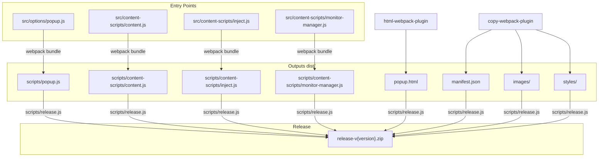

# Dependências

## Runtime (Sem dependências de runtime)

O projeto não tem dependências de runtime (`dependencies` no `package.json`). Todo o código é compilado para um bundle que roda diretamente no navegador.

---

## Build (`devDependencies`)

| Pacote | Versão | Função |
|---|---|---|
| `webpack` | ^5.97.1 | Bundler — compila e empacota os módulos ES em scripts prontos para extensão |
| `webpack-cli` | ^6.0.1 | Interface de linha de comando do webpack |
| `html-webpack-plugin` | ^5.6.0 | Gera o `popup.html` no dist a partir do template |
| `copy-webpack-plugin` | ^12.0.2 | Copia `public/` e `manifest.json` para `dist/` sem processamento |
| `archiver` | ^6.0.2 | Gera o zip de release (`npm run release`) |

---

## Plataforma

| Tecnologia | Versão | Função |
|---|---|---|
| Manifest V3 | 3 | Especificação de extensão de navegador (Chrome + Firefox) |
| JavaScript | ES2020 | Linguagem principal |
| TypeScript (apenas tipos) | — | Arquivo `translations.d.ts` com tipos globais, sem compilação TS |
| Node.js | 18+ | Ambiente de build (não vai para produção) |

---

## APIs do Navegador Utilizadas

| API | Contexto | Permissão necessária |
|---|---|---|
| `chrome.storage.local` | popup.js, utils/ | `"storage"` |
| `chrome.tabs.query` | popup.js | `"tabs"` |
| `chrome.tabs.reload` | popup.js | `"tabs"` |
| `chrome.runtime.getURL` | content.js | Automático |
| `window.fetch` (override) | inject.js | Nenhuma |
| `XMLHttpRequest` | monitor-manager.js | Nenhuma |
| `window.postMessage` | inject.js, monitor-manager.js → content.js | Nenhuma |
| `MutationObserver` | dom.js | Nenhuma |
| `localStorage` (leitura e polling) | routes/profile.js, monitor-manager.js | Nenhuma |
| `localStorage.setItem` (override) | content.js | Nenhuma |
| `history.pushState/replaceState` (override) | content.js | Nenhuma |

---

## Diagrama de Dependências de Build

---

## Compatibilidade de Navegadores

| Navegador | Suporte | Observação |
|---|---|---|
| Chrome / Chromium | ✅ | MV3 nativo |
| Firefox | ✅ | Firefox 109+ (MV3 suportado) |
| Safari | ❓ | Não testado, requer adaptação |
| Edge | ✅ | Baseado em Chromium |
