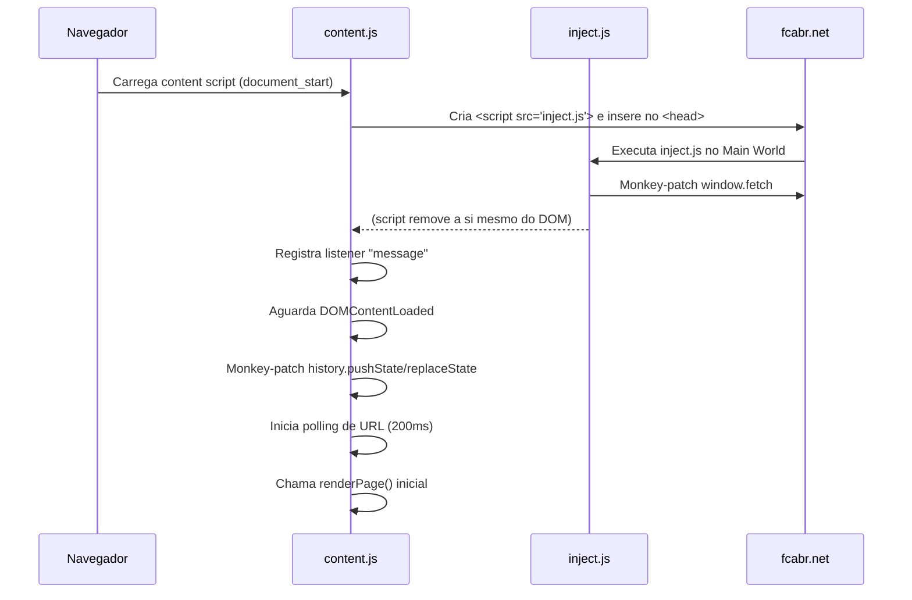
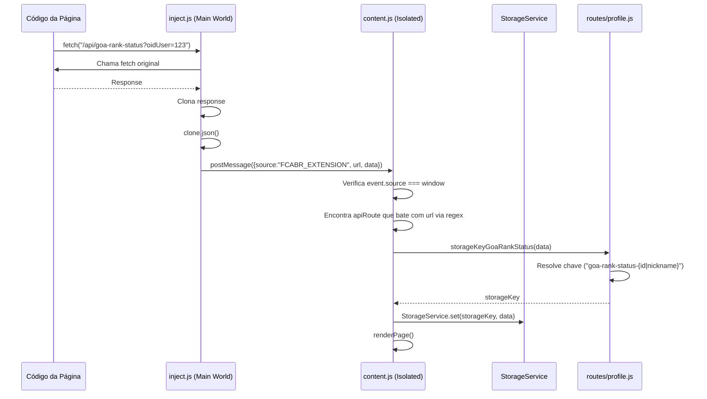
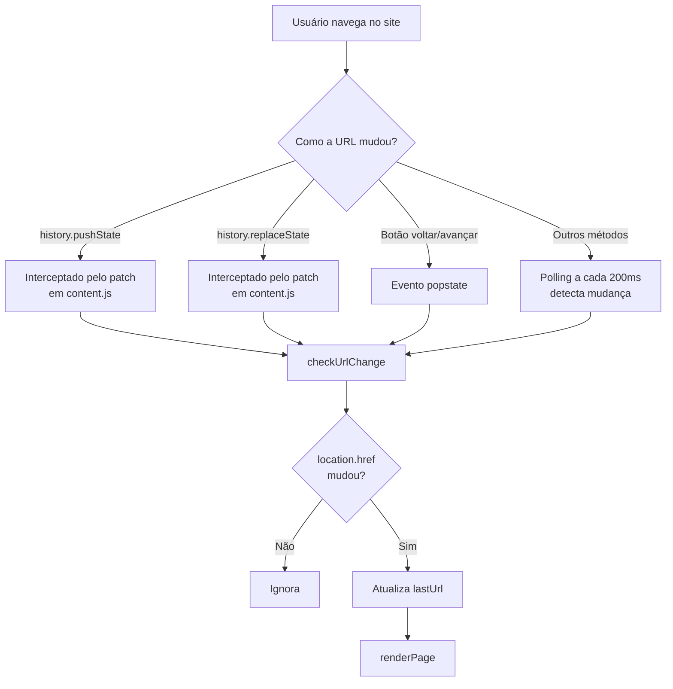
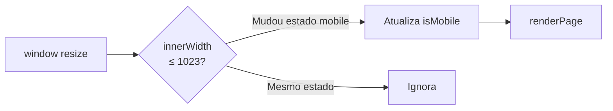
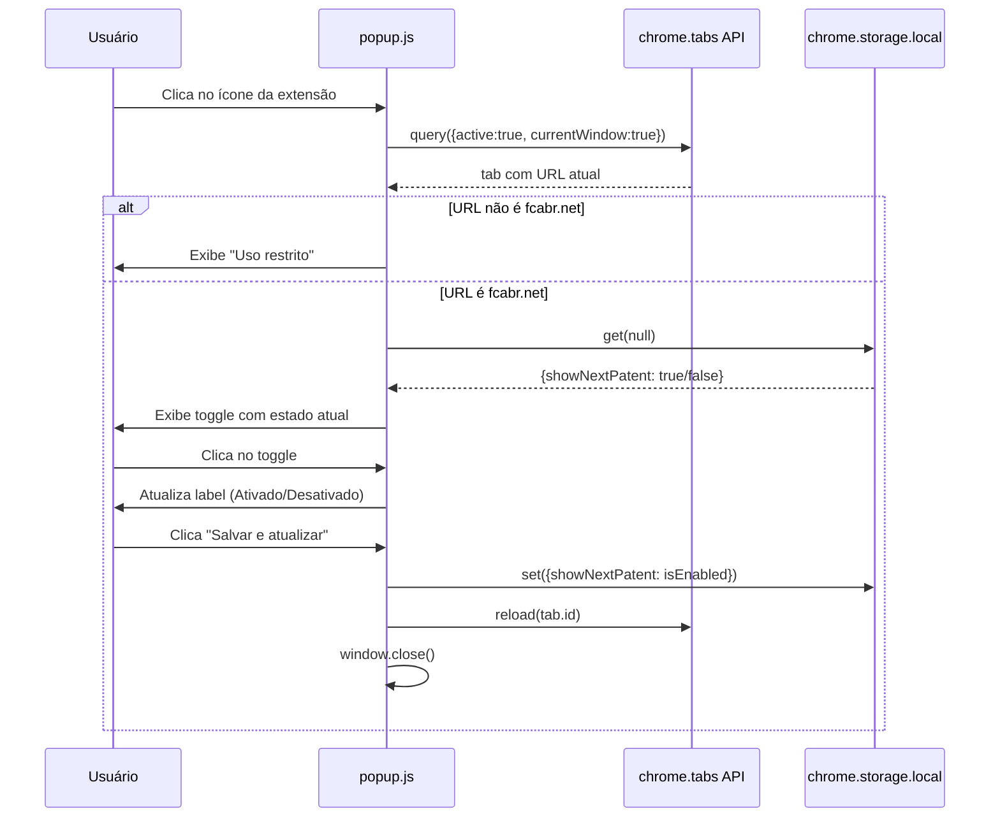

# Fluxos de Execução

## 1. Fluxo de Inicialização da Extensão



---

## 2. Fluxo de Interceptação de API



---

## 3. Fluxo de Renderização da Página de Perfil

```mermaid
flowchart TD
    A[renderPage chamado] --> B{URL bate com regex\n/[lang]/profile...?}
    B -->|Não| Z[Retorna sem fazer nada]
    B -->|Sim| C[Chama profilePage]

    C --> D{getProfilePageType\nretorna match?}
    D -->|Não| Z
    D -->|Sim| E{Tem playerName\nna URL?}

    E -->|Sim - /pt/profile/jogador| F["tipoPagina = 'PF'"]
    E -->|Não - /pt/profile| G["tipoPagina = 'PFP'"]

    F --> H[RouteKeyProfile com playerName]
    G --> I[RouteKeyProfile com ID do localStorage]

    H --> J[StorageService.get routeKey]
    I --> J

    J --> K{data existe\nno cache?}
    K -->|Não| Z
    K -->|Sim| L{tipoPagina=PF?\nnickname bate?}
    L -->|Não bate| Z
    L -->|Sim| M[getTranslations]

    M --> N[initializeStoredValues]
    N --> O{showNextPatent\n= true?}
    O -->|false| Z
    O -->|true| P[DOM.waitUntil\ncartão de XP aparecer]

    P --> Q{Cartão\nencontrado?}
    Q -->|Timeout| Z
    Q -->|Sim| R[ExperienceCard.findCardElementByName]

    R --> S[Encontra patente\nna tabela patents.js]
    S --> T{Patente\nencontrada?}
    T -->|Não| Z
    T -->|Sim| U[Calcula XP]

    U --> V["baseXp = patent.targetXp\nnextXp = data.expNecessario\nremaining = nextXp - currentXp"]
    V --> W[new ExperienceCard]
    W --> X[card.setBaseXp]
    X --> Y[card.setRemaining]
    Y --> AA[card.setNextXp]
    AA --> AB[card.setProgress]
    AB --> AC[DOM atualizado ✓]
```

---

## 4. Fluxo de Navegação SPA (Single Page Application)

O site FCABR usa navegação SPA. A extensão detecta mudanças de URL por múltiplos mecanismos:



---

## 5. Fluxo de Detecção de Responsividade



---

## 6. Fluxo de Resolução de Idioma

```mermaid
flowchart TD
    A[getTranslations chamado\ncom pathname e documentLang] --> B[resolveSelectedLanguage]
    B --> C[getLanguageFromValue pathname\nex: /pt/profile → 'pt']
    C --> D{Match\nencontrado?}
    D -->|Sim| E[Usa idioma da URL]
    D -->|Não| F[getLanguageFromValue documentLang]
    F --> G{Match\nencontrado?}
    G -->|Sim| H[Usa idioma do documento]
    G -->|Não| I[Fallback: 'pt']
    E --> J[getTranslationsByLanguage]
    H --> J
    I --> J
    J --> K{translations[lang]\nexiste?}
    K -->|Sim| L[Retorna traduções do idioma]
    K -->|Não| M[Fallback: translations.pt]
```

---

## 7. Fluxo do Popup (Configurações)



---

## 8. Fluxo de Cálculo do Cartão de XP

```
Dados da API:
  patenteAtual: "GOA Gold"
  exp: 50_000_000
  expNecessario: 80_000_000

Tabela patents.js:
  { name: "GOA Gold",    targetXp: 44_000_000 }
  { name: "GOA Diamond", targetXp: 80_000_000 }

Cálculo:
  baseXp    = 44_000_000  (targetXp da patente atual)
  nextXp    = 80_000_000  (expNecessario da API)
  remaining = max(0, 80_000_000 - 50_000_000) = 30_000_000
  progress  = ((50M - 44M) / (80M - 44M)) * 100 = 16.67%

Atualização do DOM:
  spans[0].textContent = "44.000.000"     (base XP)
  spans[1].textContent = "30.000.000 XP restante"
  spans[2].textContent = "80.000.000"     (próximo XP)
  progressBar.style.width = "16.67%"
```
