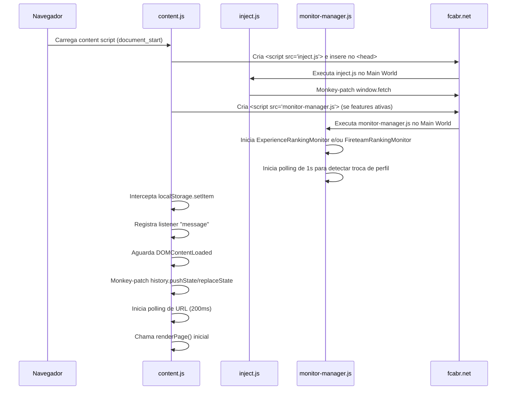
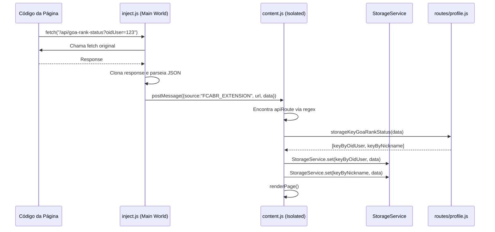
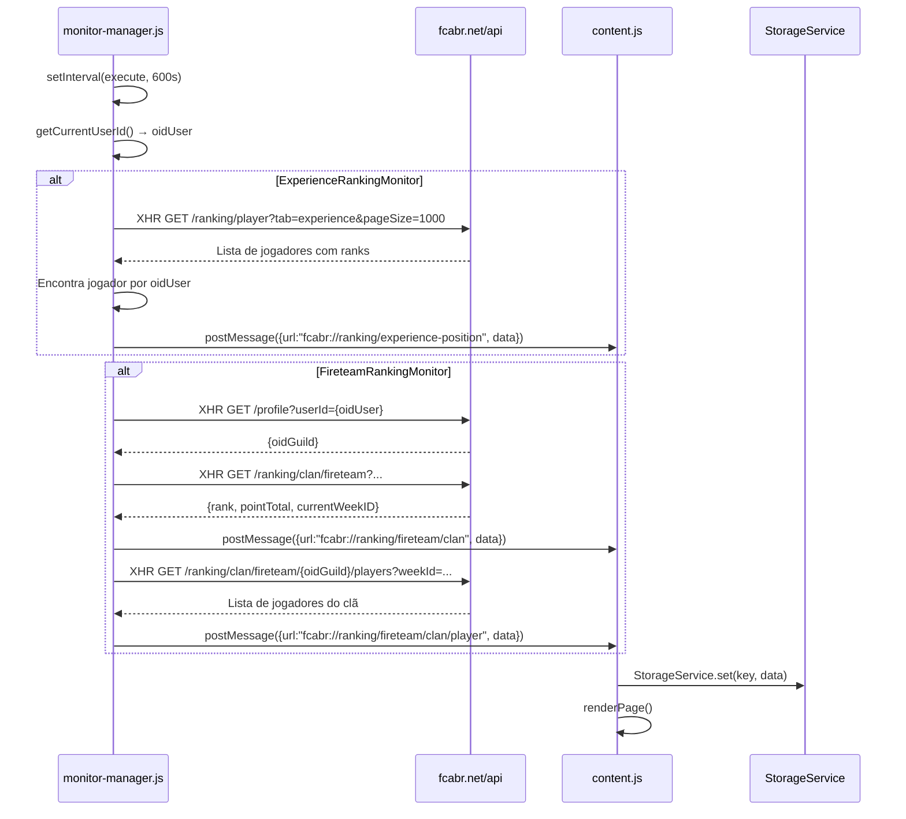
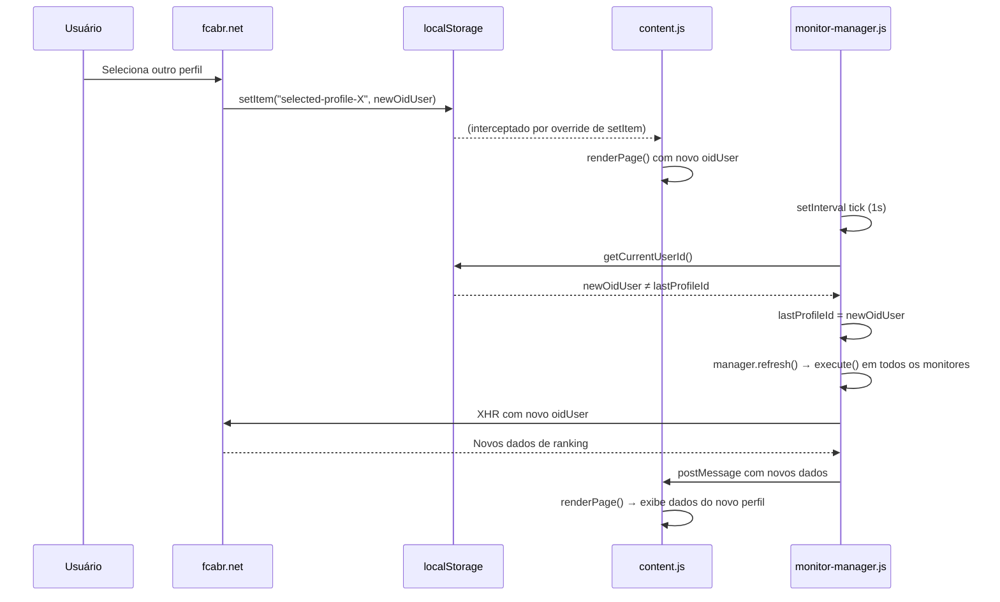
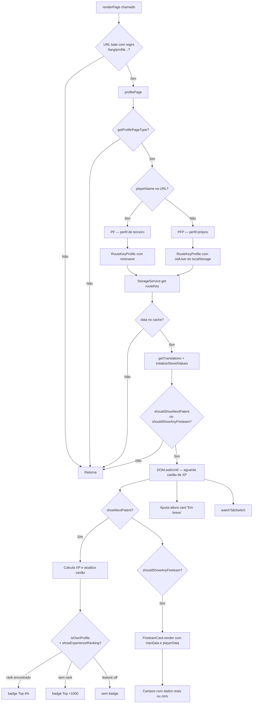
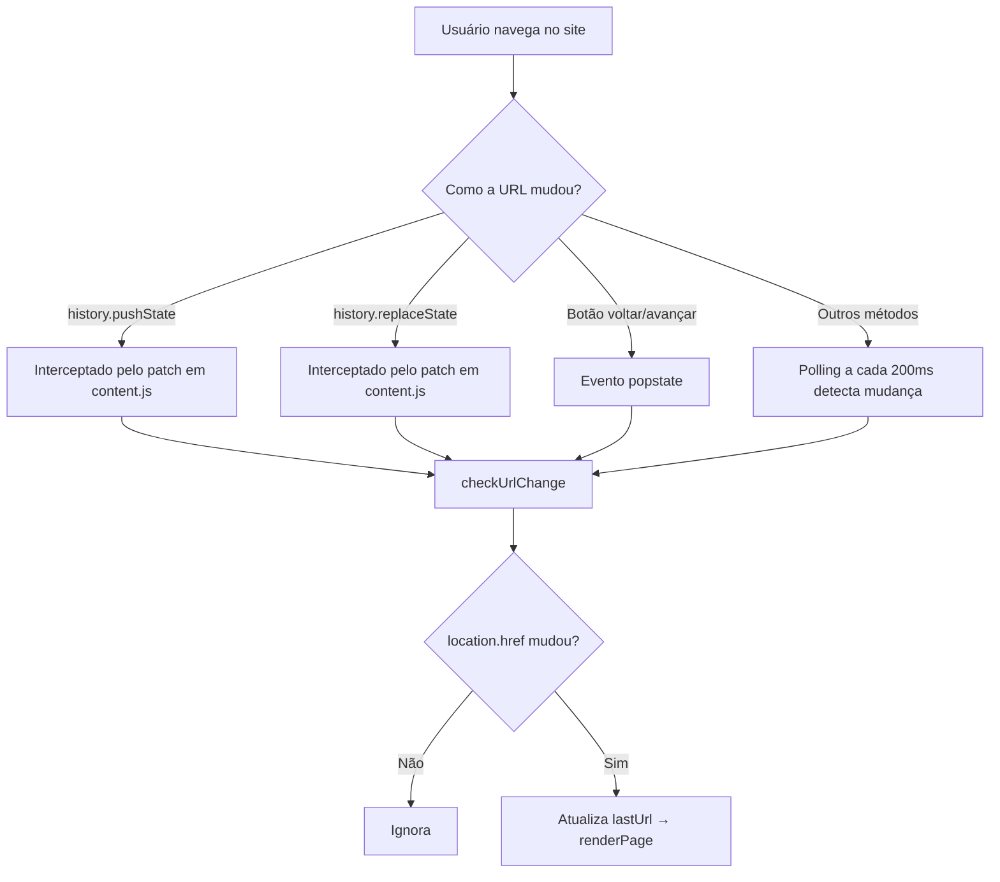
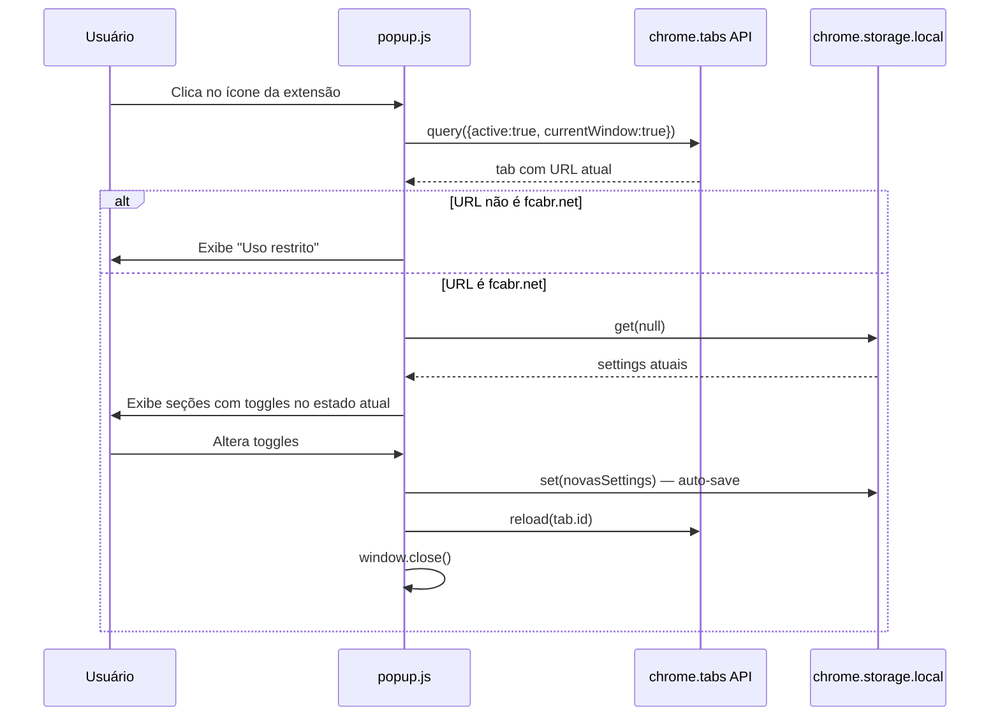

# Fluxos de Execução

## 1. Fluxo de Inicialização da Extensão



---

## 2. Fluxo de Interceptação de API (fetch)



---

## 3. Fluxo dos Monitores Periódicos



---

## 4. Fluxo de Troca de Perfil



---

## 5. Fluxo de Renderização da Página de Perfil



---

## 6. Fluxo de Navegação SPA



---

## 7. Fluxo do Popup (Configurações)



---

## 8. Fluxo de Cálculo do Cartão de XP

```
Dados da API (goa-rank-status):
  patenteAtual: "1º MAJOR"
  exp: 1.459.900
  expNecessario: 1.533.000

Tabela patents.js:
  { name: "1º MAJOR", targetXp: 1.400.000 }

Cálculo:
  baseXp    = 1.400.000  (targetXp da patente atual)
  nextXp    = 1.533.000  (expNecessario da API)
  remaining = max(0, 1.533.000 - 1.459.900) = 73.100
  progress  = ((1.459.900 - 1.400.000) / (1.533.000 - 1.400.000)) * 100 ≈ 45%

Atualização do DOM:
  spans[0].nodeValue = "1.400.000"            (base XP)
  spans[1].nodeValue = "73.100 XP restante"
  spans[2].nodeValue = "1.533.000"            (próximo XP)
  progressBar.style.width = "45%"
```
