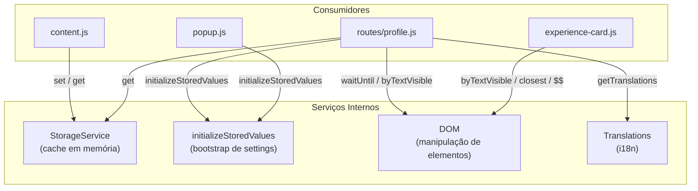

# Serviços

## Mapa de Serviços



---

## StorageService

**Arquivo:** `src/lib/storage-service.js`
**Tipo:** Cache em memória (não persistido)
**Padrão:** Singleton por módulo ES

**Responsabilidade:** Armazenar dados de API interceptados durante a sessão, para que `routes/profile.js` os recupere no momento da renderização.

**Fluxo:**
```
inject.js → postMessage → content.js → StorageService.set()
                                              ↓
                           routes/profile.js → StorageService.get()
```

**Chaves armazenadas:**

| Chave completa | Gerada por | Quando |
|---|---|---|
| `fcabr.goa-rank-status-{oidUser}` | `storageKeyGoaRankStatus` | Perfil do usuário logado |
| `fcabr.goa-rank-status-{nickname}` | `storageKeyGoaRankStatus` | Perfil de terceiro |

---

## initializeStoredValues

**Arquivo:** `src/utils/index.js`
**Tipo:** Função assíncrona utilitária

**Responsabilidade:** Garantir que `chrome.storage.local` tenha todos os valores default e retornar o estado atual mesclado.

**Chamado por:**
- `routes/profile.js` — para ler `showNextPatent` antes de renderizar
- `popup.js` — para ler `showNextPatent` ao abrir o popup

**Não chama ninguém** além do `chrome.storage.local` nativo.

---

## DOM Service

**Arquivo:** `src/lib/dom.js`
**Tipo:** Classe estática utilitária

**Responsabilidade:** Abstrair seleção e manipulação do DOM de forma conveniente.

**Chamado por:**
- `routes/profile.js` — `DOM.waitUntil()`
- `experience-card.js` — `DOM.byTextVisible()`, `DOM.$$()`, `DOM.closest()`

---

## Translations Service

**Arquivo:** `src/translations/index.js`
**Tipo:** Módulo de funções puras

**Responsabilidade:** Resolver o idioma da sessão e retornar o objeto de strings localizado.

**Chamado por:** `routes/profile.js` exclusivamente.

**Fontes de idioma (prioridade):**
1. Prefixo do pathname (`/pt/`, `/en/`)
2. `document.documentElement.lang`
3. Fallback: `"pt"`
